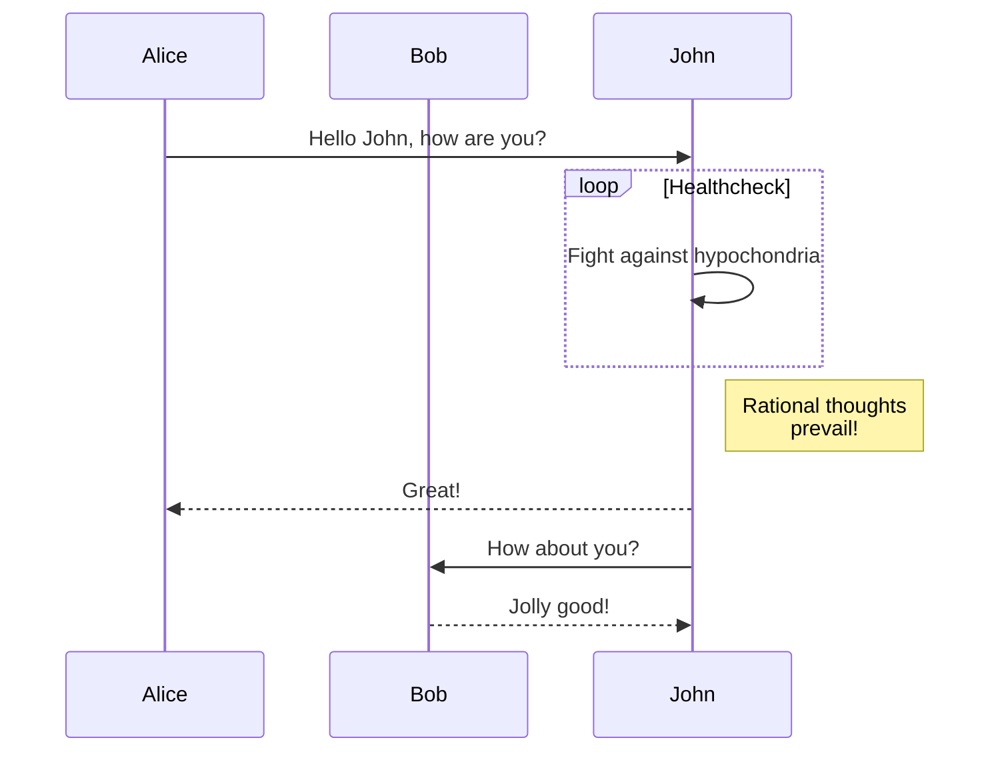
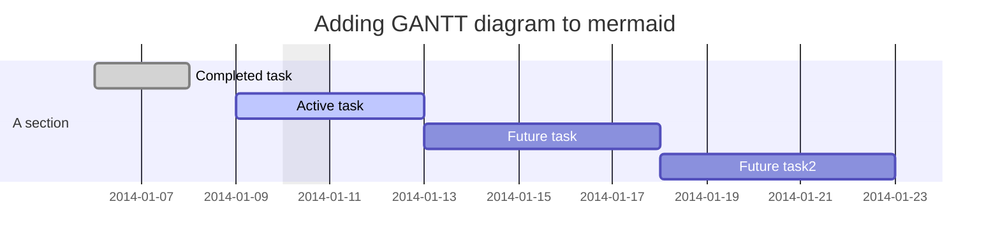
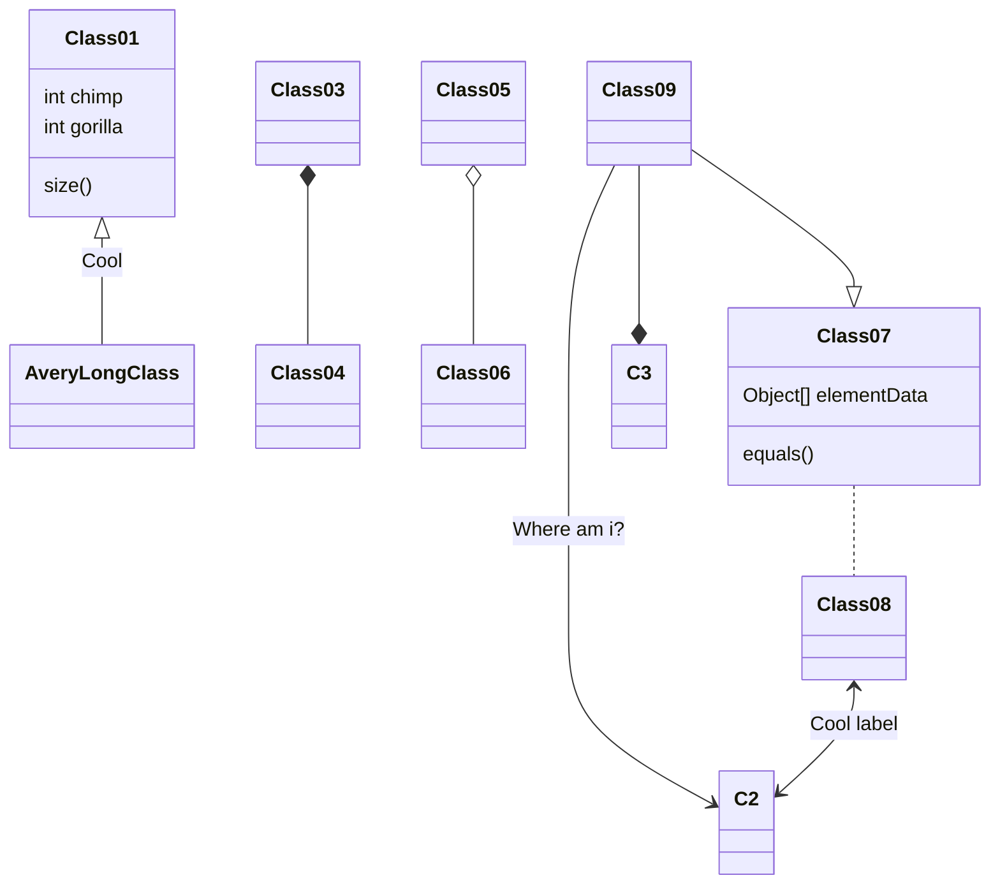
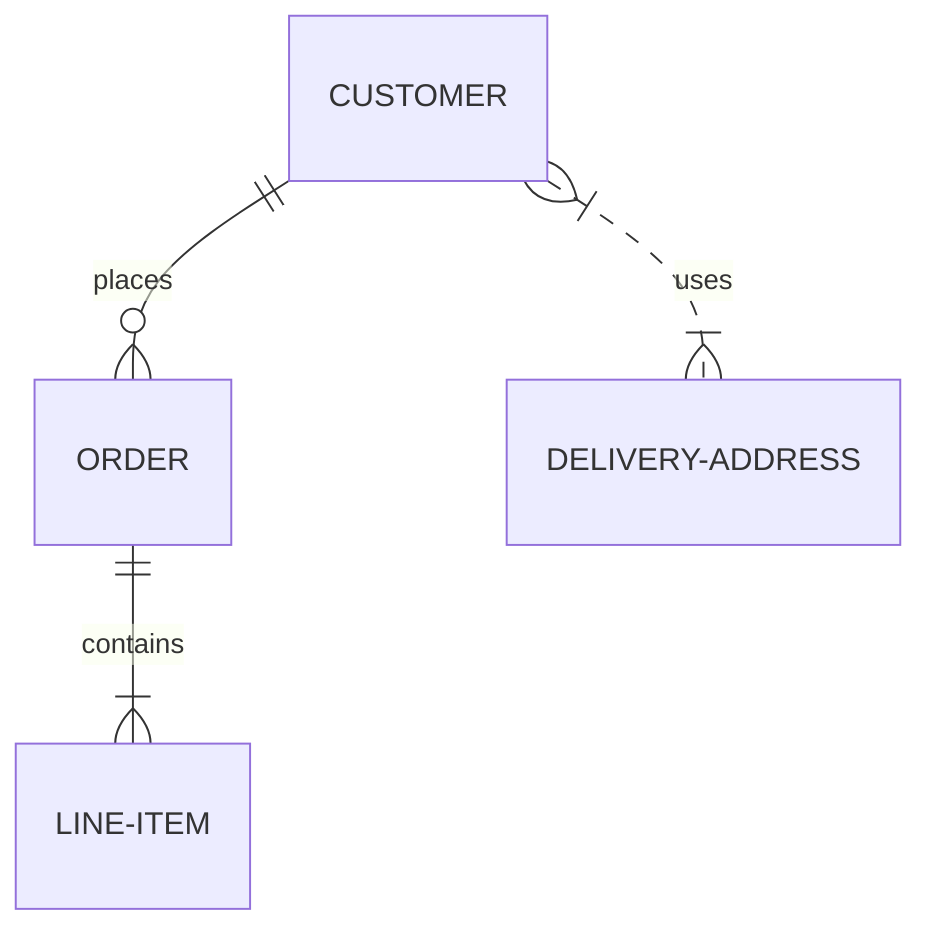
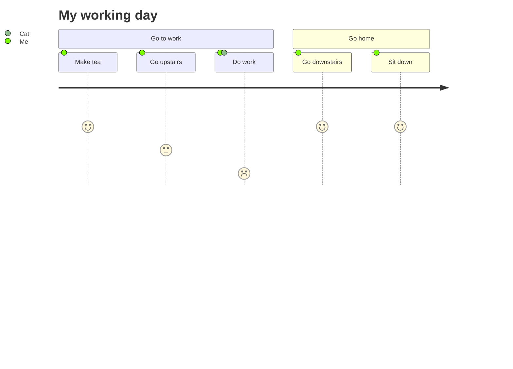

# mermaidドキュメント

## はじめに

### Mermaidについて

__Mermaidはテキストとコードを使ってダイアグラムやビジュアライゼーションを作成することができます。__

これはJavaScriptベースのダイアグラムおよびチャート作成ツールで、Markdownにインスパイアされたテキスト定義をレンダリングし、ダイアグラムを動的に作成および変更します。

> Markdownに慣れているのであれば、[Mermaidのシンタックス]()を学ぶことに問題はないでしょう。

MermaidはJavaScriptベースのダイアグラム・チャート作成ツールで、Markdownから着想を得たテキスト定義とレンダラーを使用して、複雑なダイアグラムを作成・変更することができます。Mermaidの主な目的は、ドキュメントが開発に追いつくのを助けることです。

> 冗長な文書をMermaidが解決します。

図解やドキュメントは貴重な開発者の時間を費やし、すぐに古くなってしまいます。しかし、ダイアグラムやドキュメントがないと、生産性が損なわれ、組織の学習にも支障をきたします。
Mermaidは、ユーザーが簡単に変更可能なダイアグラムを作成できるようにすることで、この問題に取り組みます。

Mermaidは、プログラマーでなくても[Mermaid Live Editor]()を使って簡単に詳細なダイアグラムを作成することを可能にします。
[チュートリアル]()にはビデオチュートリアルがあります。Mermaidをお気に入りのアプリケーションと一緒に使うには、[Mermaidの統合と使用法]()のリストをご覧ください。

Mermaidの詳しい紹介と基本的な使い方は、[ビギナーズガイド]()と[使い方]()をご覧ください。

🌐 [CDN]() | 📖 [資料]() | 🙌 [貢献]() | 📜 [更新履歴]() | 🔌 [プラグイン]()

> 🖖 安定した脈拍を保つ：マーメイドはもっと協力者を必要としている、[続きを読む]()

__🏆マーメイドがJSオープンソースアワード（2019）の「最もエキサイティングな技術の使い方」部門にノミネートされ、受賞しました!!!!__

__関係者の皆さん、プルリクエストをコミットする人、質問に答える人、そしてプロジェクトのメンテナンスを手伝ってくれているTyler Longに特別感謝します🙏。__

私たちのリリースプロセスでは、[applitools]()を使用したビジュアルリグレッションテストに大きく依存しています。Applitoolsは、使いやすく、私たちのテストと統合しやすい、素晴らしいサービスです。


#### ダイアグラムの種類

[フローチャート]()

```
graph TD;
    A-->B;
    A-->C;
    B-->D;
    C-->D;
```


[シーケンス図]()

```
sequenceDiagram
    participant Alice
    participant Bob
    Alice->>John: Hello John, how are you?
    loop Healthcheck
        John->>John: Fight against hypochondria
    end
    Note right of John: Rational thoughts <br/>prevail!
    John-->>Alice: Great!
    John->>Bob: How about you?
    Bob-->>John: Jolly good!
```





[ガントチャート]()

```
gantt
dateFormat  YYYY-MM-DD
title Adding GANTT diagram to mermaid
excludes weekdays 2014-01-10

section A section
Completed task            :done,    des1, 2014-01-06,2014-01-08
Active task               :active,  des2, 2014-01-09, 3d
Future task               :         des3, after des2, 5d
Future task2               :         des4, after des3, 5d
```





[クラス図]()

```
classDiagram
Class01 <|-- AveryLongClass : Cool
Class03 *-- Class04
Class05 o-- Class06
Class07 .. Class08
Class09 --> C2 : Where am i?
Class09 --* C3
Class09 --|> Class07
Class07 : equals()
Class07 : Object[] elementData
Class01 : size()
Class01 : int chimp
Class01 : int gorilla
Class08 <--> C2: Cool label
```





[Gitグラフ]()

```
    gitGraph
       commit
       commit
       branch develop
       commit
       commit
       commit
       checkout main
       commit
       commit
```


[エンティティ関係図 - ❗️実験]()

```
erDiagram
    CUSTOMER ||--o{ ORDER : places
    ORDER ||--|{ LINE-ITEM : contains
    CUSTOMER }|..|{ DELIVERY-ADDRESS : uses
```





[ユーザー旅程図]()

```
journey
    title My working day
    section Go to work
      Make tea: 5: Me
      Go upstairs: 3: Me
      Do work: 1: Me, Cat
    section Go home
      Go downstairs: 5: Me
      Sit down: 5: Me
```





#### インストール方法

詳細なガイドとサンプルは、[Getting Started]()と[Usage]()にあります。

また、mermaidの[Syntax]()について詳しく知ることもできます。


#### CDN

```
https://unpkg.com/mermaid@<version>/dist/
```

バージョンを選択する場合

\<version\>を希望のバージョン番号に置き換えてください。

最新バージョン： [https://unpkg.com/browse/mermaid@8.8.0/]()


#### Mermaidを導入する

Mermaidをデプロイするために：

1. node v16をインストールし、npmをインストールする必要があります。
2. npmを使用してyarnをダウンロードします。
3. 次のコマンドを入力します: `yarn add mermaid`
4. 次に、次のコマンドを使用して、mermaid を開発依存として追加します: `yarn add --dev mermaid`


#### Mermaid API:

mermaidをbundlerなしで展開するには、次のように絶対アドレスと`mermaidAPI`呼び出しを持つ`script`タグをHTMLに挿入します。

```html
<script src="https://cdn.jsdelivr.net/npm/mermaid/dist/mermaid.min.js"></script>
<script>mermaid.initialize({startOnLoad:true});
</script>
```


そうすることで、マーメイドパーサーは`class=\"mermaid \"`のついた`<div>`タグを探すよう命令します。これらのタグから、マーメイドはダイアグラム/チャートの定義を読み取り、SVGチャートにレンダリングしようとします。

[その他のサンプル]()もご覧ください。


#### 姉妹プロジェクト

- Mermaid Live Editor
- Mermaid CLI
- Mermaid Webpack Demo
- Mermaid Parcel Demo


#### 支援のお願い

いろいろなことが積み重なって、追いつくのが大変なんです。今後のmermaidの開発に協力するために、開発者のコアチームを作ることができたら素晴らしいことだと思います。

このチームの一員になると、リポジトリへの書き込みアクセスが可能になり、質問や問題に答える際にプロジェクトを代表することになります。

私たちは一緒に、次のような作業を続けることができます。

- マインドマップやertダイアグラムなど、より多くの種類のダイアグラムを追加する。
- 既存の図の改善

参加したい方は、遠慮なくご連絡ください。


#### コントリビューター向け

##### セットアップ

```
yarn install
```


##### ビルド

```
yarn build:watch
```


##### Lint

```
yarn lint
```

[eslint]()を使用しています。lintの結果をリアルタイムで得るために、[エディタプラグイン]()をインストールすることをお勧めします。


#### テスト

```
yarn test
```


ブラウザでの手動テスト：`dist/index.html`を開く


##### リリース

許可された方のみ。

`package.json`のバージョン番号を更新してください。

```
npm publish
```


上記のコマンドは、`dist`フォルダにファイルを生成し、npmjs.orgに公開するものです。


#### 関連プロジェクト

- Command Line Interface
- Live Editor
- HTTP Server


#### コントリビューター

マーメイドは成長中のコミュニティであり、常に新しい貢献者を受け入れています。お手伝いできることはたくさんありますし、いつでも手を差し伸べてくれる人を探しています。どこから手をつければいいのか知りたい方は、[このissue]()をご覧ください。

貢献の仕方についての詳しい情報は、[貢献ガイド]()にあります。


#### ダイアグラムのセキュリティと安全性

公開サイトの場合、インターネット上のユーザーからテキストを取得し、そのコンテンツを保存して、後日ブラウザで提示するのは不安定な場合があります。なぜなら、ユーザーコンテンツには、データが表示されたときに実行される悪意のあるスクリプトが埋め込まれている可能性があるからです。特にマーメイドのダイアグラムにはhtmlで使用されている文字が多く含まれているため、標準的なサニタイジングではダイアグラムが壊れてしまい、使用することができません。私たちは、受信したコードをサニタイズするために努力し、プロセスを改善し続けていますが、ループホールがないことを保証するのは困難です。

外部ユーザーがいるサイトのセキュリティをさらに強化するために、新しいセキュリティレベルを導入することにしました。これは、より良いセキュリティのための大きな前進です。

> 残念ながら、ケーキを食べるのと同時に、インタラクティブな機能の一部が悪意のあるコードと一緒にブロックされることを意味することはできません。


#### 脆弱性の報告

脆弱性を報告するには、問題の説明、問題を発生させるために行った手順、影響を受けるバージョン、および既知の場合は問題の緩和策を [security@mermaid.live]() にメールしてください。


#### 感謝

Knut Sveidqvistからのコメントです。

> グラフィカルなレイアウトと描画ライブラリを提供してくれたd3プロジェクトとdagre-d3プロジェクトに感謝します! また、シーケンス図の文法を提供してくれたjs-sequence-diagramプロジェクトに感謝します。Jessica Peter には、ガント・レンダリングのインスピレーションと出発点をいただきました。2017年4月から協力者になってくれたTyler Longに感謝します。
>
> プロジェクトをここまで導いてくれた、増え続ける協力者の皆さんに感謝します。

---

Mermaidは、Knut Sveidqvistによって、より簡単にドキュメントを作成するために作られました。


### 初心者のためのMermaidユーザーガイド（デプロイメント）

Mermaidは3つの部分から構成されています。デプロイメント、[シンタックス]()、コンフィギュレーションです。

このセクションでは、Mermaidをデプロイするための様々な方法について説明します。シンタックスを学ぶことは初心者に大きな助けとなるでしょう。

> 一般的に、マーメイドの一般的な使い方はライブエディタで十分であり、学習を始めるには良い場所です。

__全くの初心者の方は、ライブエディターのビデオ[チュートリアル]()をご覧になり、マーメイドをより深く理解することをお勧めします。__

#### mermaidの4つの使い方

1. [mermaid.live]()にあるMermaid Live Editorを使う。
2. 使い慣れたプログラムで[mermaidのプラグイン]()を使用する。
3. Mermaid JavaScript APIを呼び出す。
4. 依存関係としてマーメイドをデプロイする。

__注：すべてのアプローチを検討し、あなたのプロジェクトに最適なものを選択することをお勧めします。__

> より詳細な情報は、Usageで見ることができます。


#### 1. ライブエディターを使う

[mermaid.live]()で利用可能

`Code`セクションでは、生のマーメイドコードを書いたり編集したりすることができ、その横にあるパネルでレンダリング結果を即座に`Preview`することができます。

`Configration`セクションは、mermaidダイアグラムの外観と動作を変更するためのものです。[高度な使用法]()のセクションで、mermaidの設定について簡単に紹介されています。デフォルト値をカタログ化した完全な設定リファレンスは、[mermaidAPI]()ページで見つけることができます。


##### 履歴の編集

コードは1分ごとに「履歴」の「タイムライン」タブに自動保存され、最新の30項目が表示されます。

手動でコードを保存するには、HistoryセクションのSaveアイコンをクリックします。また、「Saved」タブからもアクセスできます。これは、ブラウザのストレージにのみ保存されます。


##### ダイアグラムを保存する

以下のいずれかの方法を選択して、保存することができます。

__後日、編集や修正を行うために、どの方法を選択しても、ダイアグラムコードを保存することをお勧めします。__


##### ダイアグラムの編集

編集は、`Live Editor`の`code`セクションにダイアグラムのコードを貼り付けるだけで、簡単に行えます。

##### Gistからの読み込み

作成したGistには、code.mmdファイルと、オプションでconfig.jsonが含まれているはずです。[例]()

エディタに gist を読み込むには、[https://mermaid.live/edit?gist=https://gist.github.com/sidharthv96/6268a23e673a533dcb198f241fd7012a]() を使用します。

View には、[https://mermaid.live/view?gist=https://gist.github.com/sidharthv96/6268a23e673a533dcb198f241fd7012a]()を使用します。


#### 2. マーメイドプラグインの使用

プラグインを使用して、一般的なアプリケーションの中からマーメイド図を生成することができます。ライブエディタと同じ方法で行うことができます。以下は、[Mermaid Plugins]()のリストです。

これについては、[使用方法のセクション]()でより詳しく説明します。


#### 3. JavaScript API の呼び出し

この方法は、Apache、IIS、nginx、node expressなどの一般的なWebサーバーで使用することができます。

また、.htmlファイルを生成するために、Notepad++のようなテキスト編集ツールが必要です。このファイルは、Webブラウザ（Firefox、Chrome、Safariなど、ただしInternet Explorerは不可）によって展開されます。

APIは、ページ上に図を表示するために、ソースの`mermaid.js`からレンダリング命令を引き出して動作します。


##### Mermaid APIの要件

.htmlファイルを書くとき、htmlコードの内部で3つの指示をWebブラウザに与えます。

a. `mermaid.js`または`mermaid.min.js`を通じてオンラインマーメイドレンダラをフェッチするためのリファレンス。
b. 作成したいダイアグラムのMermaidコード。
c. `mermaid.initialize()`呼び出し。図の外観を決定し、レンダリング処理も開始します。

__a. `<script src>`タグ内の外部CDNへの参照、または別ファイルとしてのmermaid.jsへの参照:__

```html
<body>
    <script src="https://cdn.jsdelivr.net/npm/mermaid/dist/mermaid.min.js"></script>
</body>
```


__b. `<div class="mermaid">`の中に埋め込まれたマーメイド図の定義:__

```html
<body>
    Here is a mermaid diagram:
    <div class="mermaid">
        graph TD 
        A[Client] --> B[Load Balancer] 
        B --> C[Server01] 
        B --> D[Server02]
    </div>
</body>
```


注：マーメイドチャート/グラフ/ダイアグラムの定義には、それぞれ別の`<div<`タグが必要です。


__c. `mermaid.initialize()`の呼び出し。__

`mermaid.initialize()`は、html本体で見つけたすべての`<div class="mermaid">`タグに含まれるすべての定義を受け取り、それらをダイアグラムにレンダリングします。例

```html
<body>
    <script>
        mermaid.initialize({ startOnLoad: true });
    </script>
</body>
```


注：Mermaidの描画は`mermaid.initialize()`の呼び出しで初期化されます。`mermaid.initialize()`は、簡潔にするために`mermaid.min.js`の中に入れてもかまいません。しかし、逆にすることで、`mermaid.initialize()`でウェブページ内の`<div>`タグを探し始めるタイミングを制御することができます。これは、`mermaid.min.js`の実行時にすべての`<div>`タグがロードされていない可能性があると思われる場合に便利です。

`startOnLoad`は`mermaid.initialize()`で定義できるパラメータの1つです。

| パラメータ | 説明 | タイプ | 値 |
| :---: | :---: | :---: | :---: |
| startOnLoad | ロード時にレンダリングを行うかどうかのトグル |Boolean | true, false |


##### 動作例

CDN経由でmermaidAPIを呼び出した場合の動作例を示します。


```html
<html>
    <body>
        <script src="https://cdn.jsdelivr.net/npm/mermaid/dist/mermaid.min.js"></script>
        <script>
            mermaid.initialize({ startOnLoad: true });
        </script>

        Here is one mermaid diagram:
        <div class="mermaid">
            graph TD 
            A[Client] --> B[Load Balancer] 
            B --> C[Server1] 
            B --> D[Server2]
        </div>

        And here is another:
        <div class="mermaid">
            graph TD 
            A[Client] -->|tcp_123| B
            B(Load Balancer) 
            B -->|tcp_456| C[Server1] 
            B -->|tcp_456| D[Server2]
        </div>
    </body>
</html>
```


もう一つの選択肢：この例では、mermaid.jsは別のJavaScriptファイルとして`src`で参照され、例のPathにあります。


```html
<html lang="en">
    <head>
        <meta charset="utf-8" />
    </head>
    <body>
        <div class="mermaid">
            graph LR 
            A --- B 
            B-->C[fa:fa-ban forbidden] 
            B-->D(fa:fa-spinner);
        </div>
        <div class="mermaid">
            graph TD 
            A[Client] --> B[Load Balancer] 
            B --> C[Server1] 
            B --> D[Server2]
        </div>
        <script src="The\Path\In\Your\Package\mermaid.js"></script>
        <script>
            mermaid.initialize({ startOnLoad: true });
        </script>
    </body>
</html>
```

#### 4. Mermaidを依存関係として追加する

1. npmが搭載されているnode v16をインストールします。
2. npm install -g yarn と入力して、npmを使用してyarnをダウンロードします。
3. yarnのインストールが完了したら、以下のコマンドを入力します： yarn add mermaid
4. MermaidをDev依存として追加する場合 yarn add --dev mermaid

__mermaidの作者であるKnut Sveidqvistのコメントです。__

- mermaidの初期のバージョンでは、`<script src>`タグはウェブページの`<head>`部分で呼び出されました。現在では、上記のように`<body>`に配置することができます。ドキュメントの古い部分には、以前の方法がよく反映されていますが、それは今でも有効です。


### ダイアグラムの構文（構文と設定）


## ダイアグラムの構文

### フローチャート - 基本構文

### シーケンス図

### クラス図

### 状態遷移図

### エンティティ関係図

### ユーザー旅程図

### ガントチャート

### 円グラフ図

### 要件定義図

### Git図

### C4図

### その他のサンプル


## デプロイと構成

### チュートリアル

### APIの使用方法

### Mermaid APIの構成

### ディレクティブ

### テーマ設定

### アクセシビリティオプション

### mermaid CLI

### 上級者向けMermaid（近日公開予定）


## その他

### 使用例とインテグレーション

### よくある質問


## 貢献とコミュニティ

### 初心者のための概要

### 開発と貢献

### 変更履歴

### ダイアグラムの追加

### セキュリティ