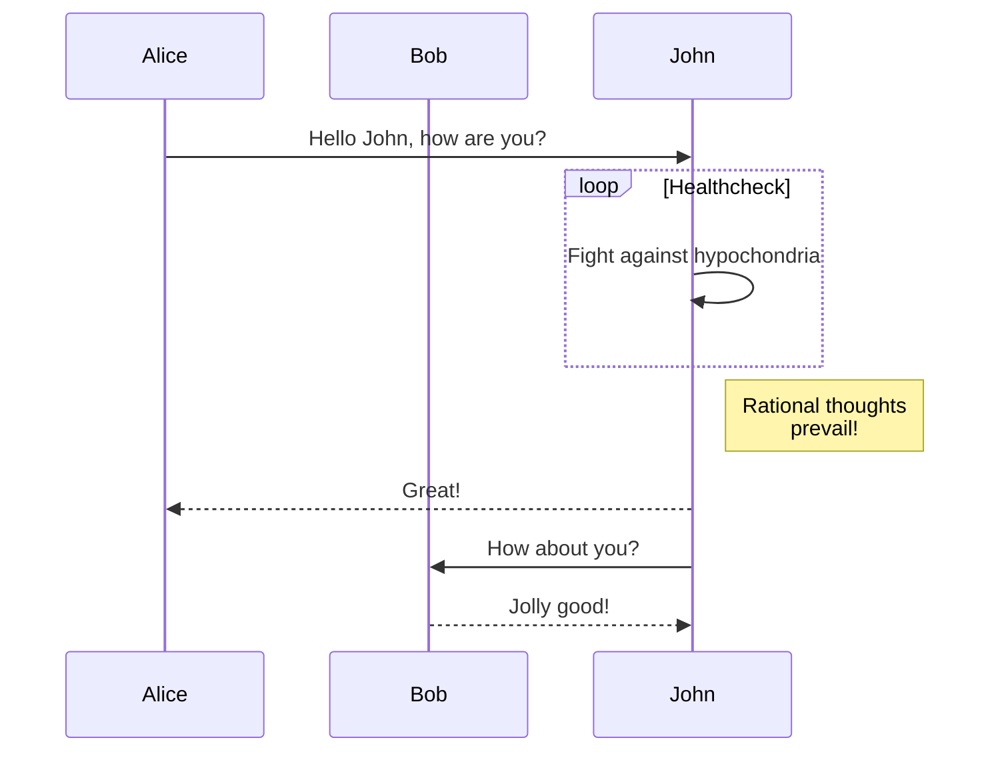
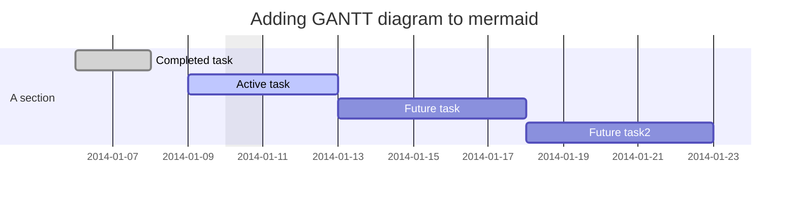
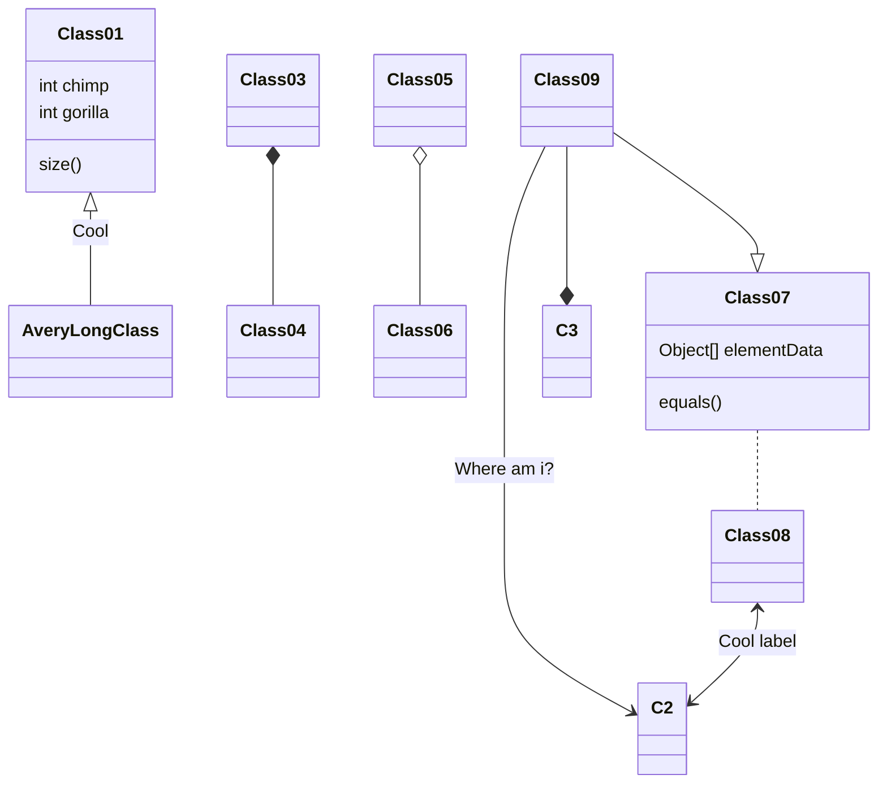
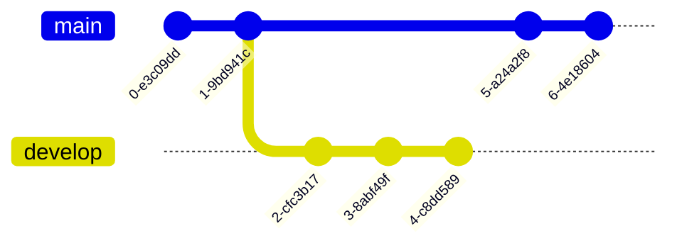
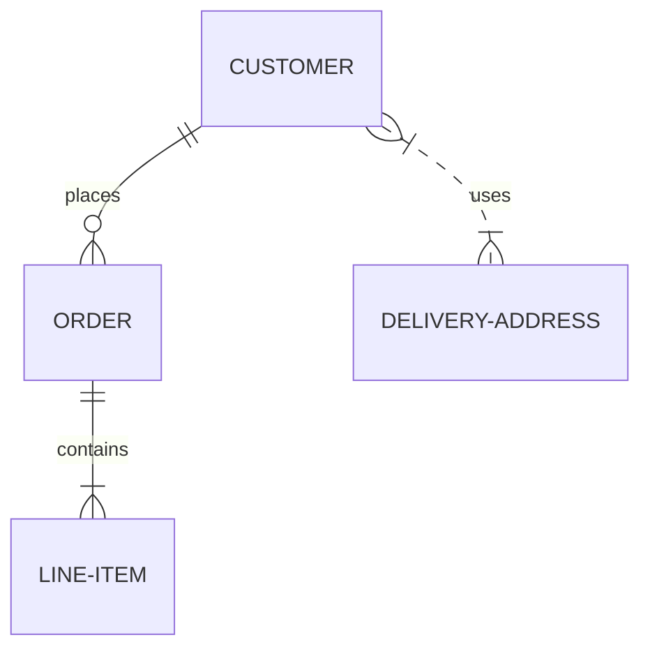
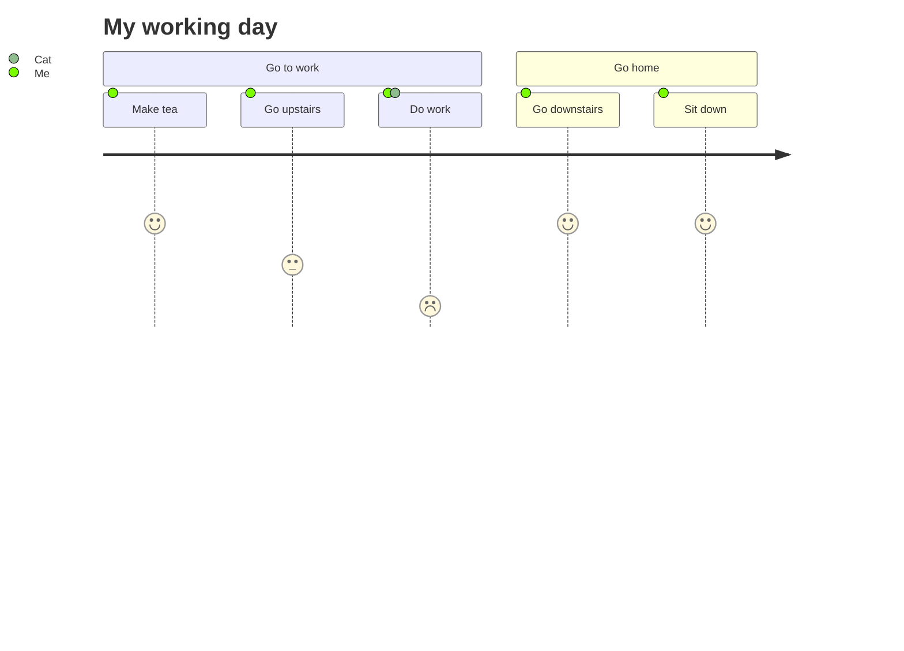

## Mermaidについて

__Mermaidはテキストとコードを使ってダイアグラムやビジュアライゼーションを作成することができます。__

これはJavaScriptベースのダイアグラムおよびチャート作成ツールで、Markdownにインスパイアされたテキスト定義をレンダリングし、ダイアグラムを動的に作成および変更します。

> Markdownに慣れているのであれば、[Mermaidのシンタックス]()を学ぶことに問題はないでしょう。

MermaidはJavaScriptベースのダイアグラム・チャート作成ツールで、Markdownから着想を得たテキスト定義とレンダラーを使用して、複雑なダイアグラムを作成・変更することができます。Mermaidの主な目的は、ドキュメントが開発に追いつくのを助けることです。

> Doc-Rot is a Catch-22 that Mermaid helps to solve.

図解やドキュメントは貴重な開発者の時間を費やし、すぐに古くなってしまいます。しかし、ダイアグラムやドキュメントがないと、生産性が損なわれ、組織の学習にも支障をきたします。
Mermaidは、ユーザーが簡単に変更可能なダイアグラムを作成できるようにすることで、この問題に取り組みます。

Mermaidは、プログラマーでなくても[Mermaid Live Editor]()を使って簡単に詳細なダイアグラムを作成することを可能にします。
[チュートリアル]()にはビデオチュートリアルがあります。Mermaidをお気に入りのアプリケーションと一緒に使うには、[Mermaidの統合と使用法]()のリストをご覧ください。

Mermaidの詳しい紹介と基本的な使い方は、[ビギナーズガイド]()と[使い方]()をご覧ください。

🌐 [CDN]() | 📖 [Documentation]() | 🙌 [Contribution]() | 📜 [Version Log]() | 🔌 [Plug-Ins]()

> 🖖 安定した脈拍を保つ：マーメイドはもっと協力者を必要としている、[続きを読む]()

__🏆マーメイドがJSオープンソースアワード（2019）の「最もエキサイティングな技術の使い方」部門にノミネートされ、受賞しました!!!!__

__関係者の皆さん、プルリクエストをコミットする人、質問に答える人、そしてプロジェクトのメンテナンスを手伝ってくれているTyler Longに特別感謝します🙏。__

私たちのリリースプロセスでは、[applitools]()を使用したビジュアルリグレッションテストに大きく依存しています。Applitoolsは、使いやすく、私たちのテストと統合しやすい、素晴らしいサービスです。

## ダイアグラムの種類

[フローチャート]()

```
graph TD;
    A-->B;
    A-->C;
    B-->D;
    C-->D;
```


[シーケンス図]()

```
sequenceDiagram
    participant Alice
    participant Bob
    Alice->>John: Hello John, how are you?
    loop Healthcheck
        John->>John: Fight against hypochondria
    end
    Note right of John: Rational thoughts <br/>prevail!
    John-->>Alice: Great!
    John->>Bob: How about you?
    Bob-->>John: Jolly good!
```



[ガンチャート]()

```
gantt
dateFormat  YYYY-MM-DD
title Adding GANTT diagram to mermaid
excludes weekdays 2014-01-10

section A section
Completed task            :done,    des1, 2014-01-06,2014-01-08
Active task               :active,  des2, 2014-01-09, 3d
Future task               :         des3, after des2, 5d
Future task2               :         des4, after des3, 5d
```



[クラス図]()

```
classDiagram
Class01 <|-- AveryLongClass : Cool
Class03 *-- Class04
Class05 o-- Class06
Class07 .. Class08
Class09 --> C2 : Where am i?
Class09 --* C3
Class09 --|> Class07
Class07 : equals()
Class07 : Object[] elementData
Class01 : size()
Class01 : int chimp
Class01 : int gorilla
Class08 <--> C2: Cool label
```



[Gitグラフ]()

```
    gitGraph
       commit
       commit
       branch develop
       commit
       commit
       commit
       checkout main
       commit
       commit
```



[エンティティ関係図 - ❗️実験]()

```
erDiagram
    CUSTOMER ||--o{ ORDER : places
    ORDER ||--|{ LINE-ITEM : contains
    CUSTOMER }|..|{ DELIVERY-ADDRESS : uses
```



[ユーザー旅程図]()

```
journey
    title My working day
    section Go to work
      Make tea: 5: Me
      Go upstairs: 3: Me
      Do work: 1: Me, Cat
    section Go home
      Go downstairs: 5: Me
      Sit down: 5: Me
```


